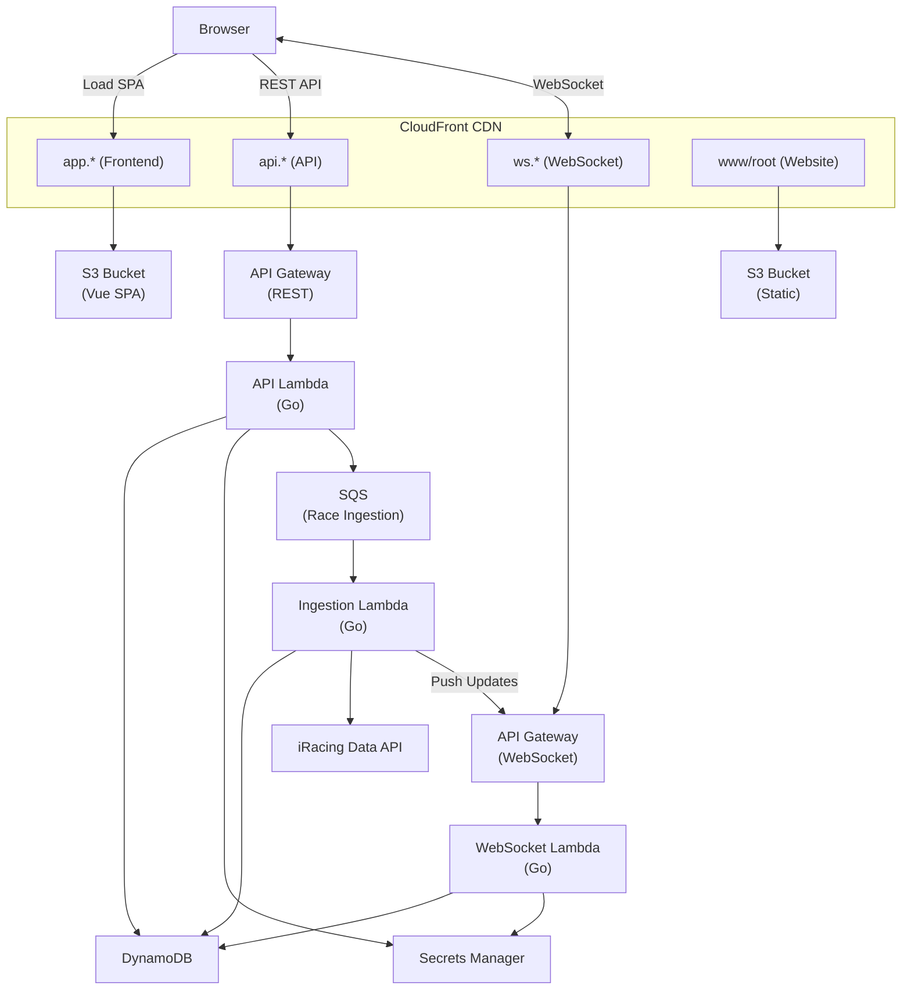

# Saturday's Spinout

A full-stack web application for race logging, built with Go, Vue 3, and deployed to AWS.

## Disclaimer

This is a toy project, meant to scratch an itch while also giving me time to play with the core elements of my craft 
without being distracted by things like mentoring, orchestrating and politicking. There are no delivery timelines, worries
about will this make sense & be maintainable to junior engineers, and so on. So there is lots of over-engineering, which feels
appropriate given the itch this is scratching is focused around an activity where we are driving simulated cars as fast
as we can just for shits and giggles.

Budget however is a real issue, and even though this architecture at its core would scale as far as your wallet allows
it should be incredibly inexpensive well beyond the point where the user base gets big enough to be problematic on its own.
So, the technologies in use are serverless and billed based on usage. Expectation is the primary cost center will be Route53 
fees, maybe a couple bucks a month in dynamo storage, and pocket change for compute (via Lambdas, all of which have very low 
reserved concurrency limits set as a safety).

## Architecture Overview



## Project Structure

```
.
├── .github/workflows/      # CI/CD pipeline (GitHub Actions)
├── aws_account_prep/       # One-time AWS account setup (see aws_account_prep/README.md)
├── api/                    # API endpoint handlers and HTTP setup
├── auth/                   # JWT creation with ES256 signing and AES-GCM encryption
├── cmd/                    # Application entry points
│   ├── lambda-based-api/   # AWS Lambda handler (REST API)
│   ├── race-ingestion-processor/ # SQS consumer for race data ingestion
│   ├── standalone-api/     # Local development server
│   └── websocket-lambda/   # WebSocket Lambda handler
├── correlation/            # Request correlation ID middleware
├── ingestion/              # Race data ingestion processing
├── iracing/                # iRacing API client and OAuth integration
├── store/                  # Data persistence layer (DynamoDB)
├── ws/                     # WebSocket handler package
├── frontend/               # Vue 3 SPA
├── terraform/              # Infrastructure as Code
├── website/                # Static marketing site
├── scripts/                # Build scripts
└── Makefile                # Build orchestration
```

## Backend (Go)

The API is built with [chi](https://github.com/go-chi/chi) and can run either as an AWS Lambda function or as a standalone HTTP server.

### Entry Points

| Mode | File | Description |
|------|------|-------------|
| REST Lambda | [`cmd/lambda-based-api/main.go`](cmd/lambda-based-api/main.go) | AWS Lambda handler using `aws-lambda-go-api-proxy` |
| Standalone | [`cmd/standalone-api/main.go`](cmd/standalone-api/main.go) | Standard `net/http` server for local development |
| WebSocket Lambda | [`cmd/websocket-lambda/main.go`](cmd/websocket-lambda/main.go) | WebSocket API Gateway handler for real-time connections |
| Race Ingestion Lambda | [`cmd/race-ingestion-processor/main.go`](cmd/race-ingestion-processor/main.go) | SQS consumer for async race data ingestion |

Both entry points share the same API setup via [`cmd/api.go`](cmd/api.go), which configures:
- Structured logging with [zerolog](https://github.com/rs/zerolog)
- AWS X-Ray tracing
- Environment-based configuration

### API Layer

| File | Purpose |
|------|---------|
| [`api/rest-api.go`](api/rest-api.go) | Router setup, middleware stack (CORS, logging, correlation IDs) |
| [`api/auth-middleware.go`](api/auth-middleware.go) | JWT authentication middleware |
| [`api/common-responses.go`](api/common-responses.go) | Shared response utilities |
| [`api/health/`](api/health/) | Health check endpoints (`GET /health/ping`) |
| [`api/auth/`](api/auth/) | Auth endpoints (`POST /auth/ir/callback`) |
| [`api/entitlement-middleware.go`](api/entitlement-middleware.go) | Entitlement-based access control middleware |
| [`api/developer/`](api/developer/) | Developer tools (requires `developer` entitlement): iRacing API doc proxy (`GET /developer/iracing-api/*`), token endpoint (`GET /developer/iracing-token`) |
| [`api/driver/`](api/driver/) | Driver endpoints (`GET /driver/{driver_id}`, `GET /driver/{driver_id}/races`, `GET /driver/{driver_id}/races/{driver_race_id}`) |

#### API Naming Conventions

Path parameters and resource IDs use descriptive prefixes to avoid confusion with iRacing's own identifiers. For example, `driver_race_id` (the unix timestamp of the race start time, used as an ID for a driver's race record) is distinct from `subsession_id` (iRacing's identifier for a session). This makes it clear which system "owns" the identifier and prevents ambiguity in API contracts.

### Authentication

The `auth/` package handles JWT creation with ES256 (ECDSA P-256) signing and AES-GCM encryption. JWTs contain encrypted iRacing tokens, allowing the backend to make iRacing API calls on behalf of authenticated users. Keys are stored in Secrets Manager and loaded at Lambda cold start.

| File | Purpose |
|------|---------|
| [`auth/service.go`](auth/service.go) | Auth service orchestrating OAuth callback flow |
| [`auth/jwt.go`](auth/jwt.go) | JWT creation with ES256 signing and AES-GCM payload encryption |
| [`auth/keys.go`](auth/keys.go) | Key parsing utilities for PEM and base64 encoded keys |

### iRacing Integration

The `iracing/` package provides OAuth and API client functionality for iRacing.

| File | Purpose |
|------|---------|
| [`iracing/oauth.go`](iracing/oauth.go) | OAuth token exchange with PKCE support |
| [`iracing/client.go`](iracing/client.go) | iRacing API client for user info and data retrieval |
| [`iracing/doc_client.go`](iracing/doc_client.go) | Proxy client for iRacing API documentation endpoints |

### Middleware

| File | Purpose |
|------|---------|
| [`correlation/correlation-id-middleware.go`](correlation/correlation-id-middleware.go) | Generates/propagates correlation IDs for request tracing |

### Data Store

The persistence layer uses DynamoDB with a single-table design.

#### `driver#<id>` partition

| Sort Key | Description | Attributes                                                                                                                                                                                         |
|----------|-------------|----------------------------------------------------------------------------------------------------------------------------------------------------------------------------------------------------|
| `info` | Driver record | driver_name, member_since, races_ingested_to, first_login, last_login, login_count, session_count, entitlements                                                                                  |
| `ingestion_lock` | Distributed lock for race ingestion | locked_until, ttl                                                                                                                                                                                  |
| `ws#<connectionId>` | WebSocket connection | connected_at, ttl                                                                                                                                                                                  |
| `session#<timestamp>` | Race participation (list view) | subsession_id, track_id, car_id, start_time, start_position, start_position_in_class, finish_position, finish_position_in_class, incidents, old_cpi, new_cpi, old_irating, new_irating, reason_out |

#### `websocket#<id>` partition

| Sort Key | Description      | Attributes                            |
|----------|------------------|---------------------------------------|
| `info` | Websocket Record | driver_id |

Note, this is basically just indexing websockets -> driver, could be a GSI but seems like less fuss just to explicitly write things

#### `session#<id>` partition

| Sort Key                                | Description | Attributes                                                                                                                                                                |
|-----------------------------------------|-------------|---------------------------------------------------------------------------------------------------------------------------------------------------------------------------|
| `info`                                  | Race metadata | subsession_id, track_id, start_time                                                                                                                                       |
| `car_class#<car_class_id>`              | Car class in session | subsession_id, strength_of_field, num_entries                                                                                                                             |
| `car_class#<car_class_id>#car#<car_id>` | Car in class | subsession_id, car_id                                                                                                                                                     |
| `drivers#driver#<driver_id>`            | Driver's result | subsession_id, driver_id, car_id, start_position, start_position_in_class, finish_position, finish_position_in_class, old_cpi, new_cpi, incidents, old_irating, new_irating, reason_out, ai |
| `laps#driver#<driver_id>#lap#<lap>`     | Lap data | subsession_id, driver_id, lap_number, lap_time, flags, incident, lap_events                                                                                               |

Expected access patterns: 
* Retrieving high level session details (pulls info and car_class stuff in one go)
* Pulling drivers by session
* Pulling laps by driver and session

#### `global` partition

| Sort Key | Description | Attributes                             |
|----------|-------------|----------------------------------------|
| `counters` | Aggregate counts | drivers, tracks, notes, sessions, laps |

| File | Purpose |
|------|---------|
| [`store/dynamo_store.go`](store/dynamo_store.go) | DynamoDB client and CRUD operations |
| [`store/dynamo_models.go`](store/dynamo_models.go) | Attribute mapping between entities and DynamoDB items |
| [`store/entities.go`](store/entities.go) | Domain entity definitions |

### WebSocket

The `ws/` package handles real-time WebSocket connections via API Gateway WebSocket APIs.

| File | Purpose |
|------|---------|
| [`ws/handler.go`](ws/handler.go) | Main router - dispatches to route-specific handlers |
| [`ws/push.go`](ws/push.go) | `Pusher` abstraction for sending messages and managing connections |
| [`ws/auth/handler.go`](ws/auth/handler.go) | Authentication handler - validates JWT, stores connection |
| [`ws/ping/handler.go`](ws/ping/handler.go) | Heartbeat handler - verifies connection, responds with pong |

**Connection Flow:**
1. Client connects to `wss://ws.{domain}`
2. Client sends `{"action": "auth", "token": "<JWT>"}` to authenticate
3. Server validates JWT, stores connection mapping in DynamoDB
4. Client sends periodic `{"action": "pingRequest", "driverId": <id>}` for heartbeat
5. Connections have 24h TTL in DynamoDB for automatic cleanup

### Race Ingestion

The `ingestion/` package handles asynchronous ingestion of race history from the iRacing Data API. Processing is decoupled from the REST API via SQS.

| File | Purpose |
|------|---------|
| [`ingestion/race-processor.go`](ingestion/race-processor.go) | Fetches race results from iRacing and stores them |

**Ingestion Flow:**
1. REST API receives request at `POST /ingestion/race` with authenticated user
2. API checks for active ingestion lock; returns 429 with Retry-After if locked
3. API enqueues message to SQS with driver ID and iRacing access token
4. Race Ingestion Lambda consumes message, acquires distributed lock (conditional write)
5. If lock already held, logs warning and returns success (SQS message acknowledged)
6. Queries iRacing `/data/results/search_series`, filters to races only (event_type=5)
7. For each race, fetches full session results and lap data for all drivers
8. Stores session info, car classes, driver results, and lap data in DynamoDB (skips if session already exists from another driver's ingestion)
9. Driver's `races_ingested_to` timestamp is updated for incremental sync
10. Lock released before recursing; allowed to expire naturally when up-to-date (cooldown period)

The iRacing search API returns chunked responses (results split across multiple S3 URLs). The client fetches all chunks and combines them. Search window is configurable (default 10 days) via `SEARCH_WINDOW_IN_DAYS`.

**Distributed Lock:** The ingestion lock prevents concurrent ingestion for the same driver. It uses a DynamoDB conditional write with TTL for automatic cleanup. The lock duration (default 15 minutes) serves as both a timeout for long-running ingestion and a cooldown period after completion.

## Frontend (Vue 3 + TypeScript)

A single-page application built with Vue 3, TypeScript, and Vite.

| File | Purpose |
|------|---------|
| [`frontend/src/main.ts`](frontend/src/main.ts) | Application bootstrap |
| [`frontend/src/App.vue`](frontend/src/App.vue) | Root component |
| [`frontend/src/router/index.ts`](frontend/src/router/index.ts) | Vue Router configuration |
| [`frontend/src/views/HomeView.vue`](frontend/src/views/HomeView.vue) | Home page |

## Infrastructure (Terraform)

All AWS infrastructure is defined in Terraform with workspace support for multiple environments.

| File | Purpose |
|------|---------|
| [`terraform/api.tf`](terraform/api.tf) | REST API Lambda, API Gateway, certificates, environment variables |
| [`terraform/race-ingestion.tf`](terraform/race-ingestion.tf) | SQS queue, Race Ingestion Lambda, event source mapping |
| [`terraform/websockets.tf`](terraform/websockets.tf) | WebSocket API Gateway, custom domain, routes |
| [`terraform/websockets-lambda.tf`](terraform/websockets-lambda.tf) | WebSocket Lambda function and IAM permissions |
| [`terraform/front-end.tf`](terraform/front-end.tf) | S3 bucket, CloudFront distribution for SPA |
| [`terraform/website.tf`](terraform/website.tf) | S3 bucket, CloudFront for static site |
| [`terraform/store.tf`](terraform/store.tf) | DynamoDB table (with TTL for WebSocket connections) |
| [`terraform/secrets.tf`](terraform/secrets.tf) | Secrets Manager secrets (iRacing credentials, JWT signing/encryption keys) |
| [`terraform/backend.tf`](terraform/backend.tf) | S3 backend for Terraform state |

## CI/CD

### Continuous Integration

GitHub Actions runs on push and PR to `main`. The workflow ([`.github/workflows/ci.yml`](.github/workflows/ci.yml)):

1. **Backend tests** - Runs Go tests with race detection and coverage against a DynamoDB Local service container
2. **Frontend tests** - Runs Vitest with coverage
3. **Build** - Builds the Lambda deployment package (only after tests pass)

Test results are published as GitHub check annotations and coverage is uploaded to Codecov.

### Deployment

Deployments are triggered by publishing a GitHub release. The workflow ([`.github/workflows/deploy.yml`](.github/workflows/deploy.yml)):

1. **Build Lambdas** - Compiles Go Lambda functions
2. **Terraform Apply** - Updates AWS infrastructure
3. **Build Frontend** - Compiles Vue SPA with production API URLs
4. **Deploy Frontend** - Syncs to S3, invalidates CloudFront cache
5. **Deploy Website** - Syncs static site to S3

#### Required GitHub Secrets

| Secret | Description |
|--------|-------------|
| `AWS_ACCOUNT` | AWS account ID for OIDC role assumption |
| `STATE_BUCKET` | S3 bucket name for Terraform state |
| `IRACING_CLIENT_ID` | iRacing OAuth client ID for frontend build |
| `CODECOV_TOKEN` | Codecov upload token (for CI coverage) |

#### AWS Authentication

The deploy workflow uses OIDC federation to assume an IAM role (`github-actions-deploy`) without storing long-lived credentials. The role and trust policy are managed in [`aws_account_prep/github-actions.tf`](aws_account_prep/github-actions.tf).

## Development

See [CODING_STANDARDS.md](CODING_STANDARDS.md) for coding conventions and patterns.

### Prerequisites

- Make (included on Linux/macOS; Windows users can use [GnuWin32](http://gnuwin32.sourceforge.net/packages/make.htm) or WSL)
- Go 1.21+
- Node.js 18+
- Terraform 1.0+
- AWS CLI (configured)
- Docker (for local DynamoDB)

Run `make` or `make help` to see all available targets.

### Initial Setup

#### AWS Account Prep

Before deploying infrastructure for the first time in a new AWS account, run the one-time account setup. This creates the GitHub Actions OIDC provider, API Gateway CloudWatch logging role, and DNS records. See [`aws_account_prep/README.md`](aws_account_prep/README.md) for details.

```bash
cd aws_account_prep
terraform init -backend-config="bucket=your-state-bucket-name"
terraform apply -var="state_bucket=your-state-bucket-name"
```

#### Terraform

The Terraform backend uses a partial configuration. You'll need to provide the S3 bucket name during init:

```bash
cd terraform
terraform init -backend-config="bucket=your-state-bucket-name"
```

#### Frontend

Copy the example environment file and configure your iRacing OAuth client ID:

```bash
cp frontend/.env.local.example frontend/.env.local
```

Edit `frontend/.env.local` and set `VITE_IRACING_CLIENT_ID` to your iRacing OAuth client ID.

### Local Development

Run the backend API:
```bash
make run-rest-api
```

Run the frontend (in a separate terminal):
```bash
make run-frontend
```

The frontend dev server runs on `http://localhost:5173` and the API on `http://localhost:8080`.

#### Environment Variables from Terraform

The `make run-rest-api` target automatically sources environment variables from Terraform, ensuring local development uses the same configuration as the deployed Lambda. This is accomplished via the `app_env_vars` output:

```hcl
# In terraform/api.tf
locals {
  app_env_vars = {
    LOG_LEVEL                  = "info"
    CORS_ALLOWED_ORIGINS       = "..."
    IRACING_CREDENTIALS_SECRET = data.aws_secretsmanager_secret.iracing_credentials.arn
    JWT_SIGNING_KEY_SECRET     = aws_secretsmanager_secret.jwt_signing_key.arn
    JWT_ENCRYPTION_KEY_SECRET  = aws_secretsmanager_secret.jwt_encryption_key.arn
  }
}

# Lambda uses the same map
resource "aws_lambda_function" "api_lambda" {
  environment {
    variables = local.app_env_vars
  }
}

# Output for local dev (formatted as KEY=VALUE pairs)
output "app_env_vars" {
  value = join(" ", [for k, v in local.app_env_vars : "${k}=${v}"])
}
```

The Makefile then uses this output:
```makefile
run-rest-api:
	env $(terraform -chdir=terraform output -raw app_env_vars) LOG_LEVEL=trace go run ...
```

This pattern ensures that any new environment variables added to the Lambda are automatically available during local development without manual synchronization.

### Testing

Tests use a local DynamoDB container. Manage it with:

```bash
make dynamo-start   # Start local DynamoDB (creates container if needed)
make dynamo-stop    # Stop the container (preserves data)
make dynamo-rm      # Stop and remove the container
make dynamo-status  # Check container status
```

Run tests:
```bash
go test ./...
```

### Building

```bash
# Build Lambda deployment package
make build

# Build frontend for deployment
make build-frontend
```

### Deploying

The frontend build sources the API URL from Terraform output (`terraform output -raw api_url`), so the build is workspace-specific. When switching Terraform workspaces, always rebuild the frontend before deploying:

```bash
# Switch workspace
cd terraform && terraform workspace select <workspace> && cd ..

# Clean and rebuild frontend for the new workspace
make clean
make build-frontend

# Deploy
make deploy-frontend
```

Other deploy commands:

```bash
# Deploy static website
make deploy-website
```

## Environment Variables

### Backend

These are managed in `terraform/api.tf` as `local.app_env_vars` and automatically provided to both Lambda and local development.

| Variable | Description |
|----------|-------------|
| `LOG_LEVEL` | Logging level (trace, debug, info, warn, error) |
| `CORS_ALLOWED_ORIGINS` | Comma-separated list of allowed origins |
| `IRACING_CREDENTIALS_SECRET` | ARN of Secrets Manager secret containing iRacing OAuth credentials |
| `JWT_SIGNING_KEY_SECRET` | ARN of Secrets Manager secret containing ECDSA P-256 private key (PEM) |
| `JWT_ENCRYPTION_KEY_SECRET` | ARN of Secrets Manager secret containing AES-256 key (base64) |

### Race Ingestion Lambda

| Variable | Description |
|----------|-------------|
| `LOG_LEVEL` | Logging level (trace, debug, info, warn, error) |
| `DYNAMODB_TABLE` | DynamoDB table name |
| `SEARCH_WINDOW_IN_DAYS` | Days to search per invocation (default: 10) |
| `INGESTION_LOCK_DURATION_SECONDS` | Duration of the distributed lock to prevent concurrent ingestion (default: 900) |

### Frontend

| Variable | Required | Description |
|----------|----------|-------------|
| `VITE_API_BASE_URL` | No | API base URL (defaults to `http://localhost:8080`) |
| `VITE_WS_BASE_URL` | No | WebSocket base URL (defaults to `ws://localhost:8081`) |
| `VITE_IRACING_CLIENT_ID` | Yes | iRacing OAuth client ID (see `frontend/.env.local.example`) |