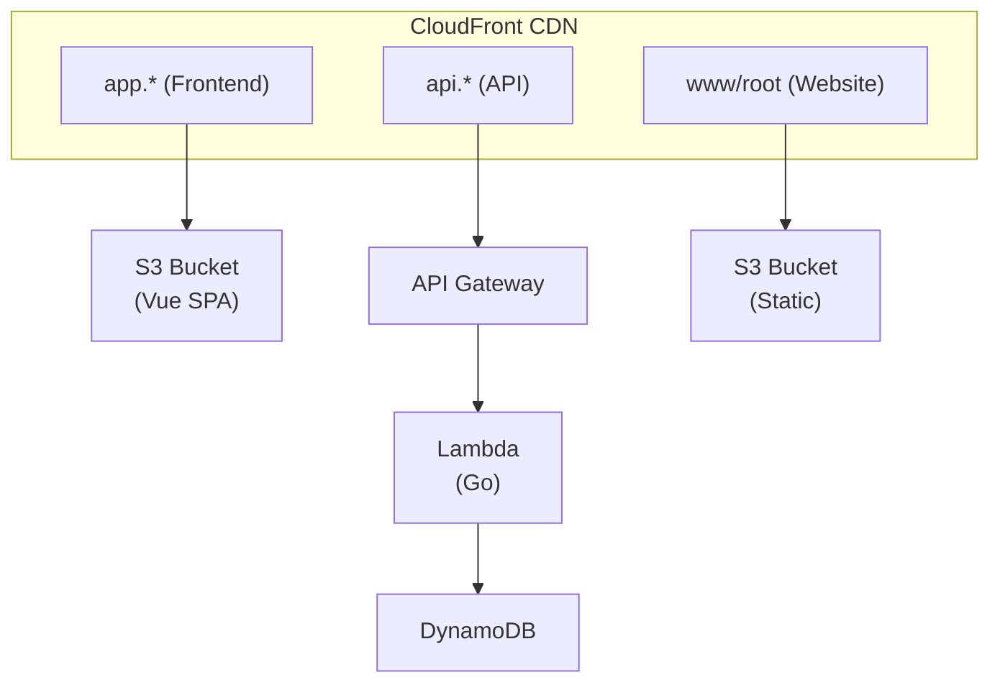

# Saturday's Spinout

A full-stack web application for race logging, built with Go, Vue 3, and deployed to AWS.

## Architecture Overview



## Project Structure

```
.
├── api/                    # API endpoint handlers and HTTP setup
├── cmd/                    # Application entry points
│   ├── lambda-based-api/   # AWS Lambda handler
│   └── standalone-api/     # Local development server
├── correlation/            # Request correlation ID middleware
├── store/                  # Data persistence layer (DynamoDB)
├── frontend/               # Vue 3 SPA
├── terraform/              # Infrastructure as Code
├── website/                # Static marketing site
├── scripts/                # Build scripts
└── Makefile                # Build orchestration
```

## Backend (Go)

The API is built with [chi](https://github.com/go-chi/chi) and can run either as an AWS Lambda function or as a standalone HTTP server.

### Entry Points

| Mode | File | Description |
|------|------|-------------|
| Lambda | [`cmd/lambda-based-api/main.go`](cmd/lambda-based-api/main.go) | AWS Lambda handler using `aws-lambda-go-api-proxy` |
| Standalone | [`cmd/standalone-api/main.go`](cmd/standalone-api/main.go) | Standard `net/http` server for local development |

Both entry points share the same API setup via [`cmd/api.go`](cmd/api.go), which configures:
- Structured logging with [zerolog](https://github.com/rs/zerolog)
- AWS X-Ray tracing
- Environment-based configuration

### API Layer

| File | Purpose |
|------|---------|
| [`api/rest-api.go`](api/rest-api.go) | Router setup, middleware stack (CORS, logging, correlation IDs) |
| [`api/ping-endpoint.go`](api/ping-endpoint.go) | Health check endpoint (`GET /health/ping`) |
| [`api/common-responses.go`](api/common-responses.go) | Shared response utilities |

### Middleware

| File | Purpose |
|------|---------|
| [`correlation/correlation-id-middleware.go`](correlation/correlation-id-middleware.go) | Generates/propagates correlation IDs for request tracing |

### Data Store

The persistence layer uses DynamoDB with a single-table design. See the [DynamoDB Schema](https://docs.google.com/spreadsheets/d/180olt3Va13ixvT3XxMSK6MDvFg8pyDLWFzAqu48gUJM/edit?gid=0#gid=0) for the full table structure.

| File | Purpose |
|------|---------|
| [`store/dynamo_store.go`](store/dynamo_store.go) | DynamoDB client and CRUD operations |
| [`store/dynamo_models.go`](store/dynamo_models.go) | Attribute mapping between entities and DynamoDB items |
| [`store/entities.go`](store/entities.go) | Domain entity definitions |

## Frontend (Vue 3 + TypeScript)

A single-page application built with Vue 3, TypeScript, and Vite.

| File | Purpose |
|------|---------|
| [`frontend/src/main.ts`](frontend/src/main.ts) | Application bootstrap |
| [`frontend/src/App.vue`](frontend/src/App.vue) | Root component |
| [`frontend/src/router/index.ts`](frontend/src/router/index.ts) | Vue Router configuration |
| [`frontend/src/views/HomeView.vue`](frontend/src/views/HomeView.vue) | Home page |

## Infrastructure (Terraform)

All AWS infrastructure is defined in Terraform with workspace support for multiple environments.

| File | Purpose |
|------|---------|
| [`terraform/api.tf`](terraform/api.tf) | Lambda, API Gateway, certificates |
| [`terraform/front-end.tf`](terraform/front-end.tf) | S3 bucket, CloudFront distribution for SPA |
| [`terraform/website.tf`](terraform/website.tf) | S3 bucket, CloudFront for static site |
| [`terraform/store.tf`](terraform/store.tf) | DynamoDB table |
| [`terraform/backend.tf`](terraform/backend.tf) | S3 backend for Terraform state |

## Development

### Prerequisites

- Go 1.21+
- Node.js 18+
- Terraform 1.0+
- AWS CLI (configured)
- Docker (for local DynamoDB)

### Local Development

Run the backend API:
```bash
make run-rest-api
```

Run the frontend (in a separate terminal):
```bash
make run-frontend
```

The frontend dev server runs on `http://localhost:5173` and the API on `http://localhost:8080`.

### Testing

Tests use a local DynamoDB container. Manage it with:

```bash
make dynamo-start   # Start local DynamoDB (creates container if needed)
make dynamo-stop    # Stop the container (preserves data)
make dynamo-rm      # Stop and remove the container
make dynamo-status  # Check container status
```

Run tests:
```bash
go test ./...
```

### Building

```bash
# Build Lambda deployment package
make build

# Build frontend for deployment
make build-frontend
```

### Deploying

The frontend build sources the API URL from Terraform output (`terraform output -raw api_url`), so the build is workspace-specific. When switching Terraform workspaces, always rebuild the frontend before deploying:

```bash
# Switch workspace
cd terraform && terraform workspace select <workspace> && cd ..

# Clean and rebuild frontend for the new workspace
make clean
make build-frontend

# Deploy
make deploy-frontend
```

Other deploy commands:

```bash
# Deploy static website
make deploy-website
```

## Environment Variables

### Backend

| Variable | Required | Description |
|----------|----------|-------------|
| `LOG_LEVEL` | Yes | Logging level (trace, debug, info, warn, error) |
| `CORS_ALLOWED_ORIGINS` | Yes | Comma-separated list of allowed origins |

### Frontend

| Variable | Required | Description |
|----------|----------|-------------|
| `VITE_API_BASE_URL` | No | API base URL (defaults to `http://localhost:8080`) |